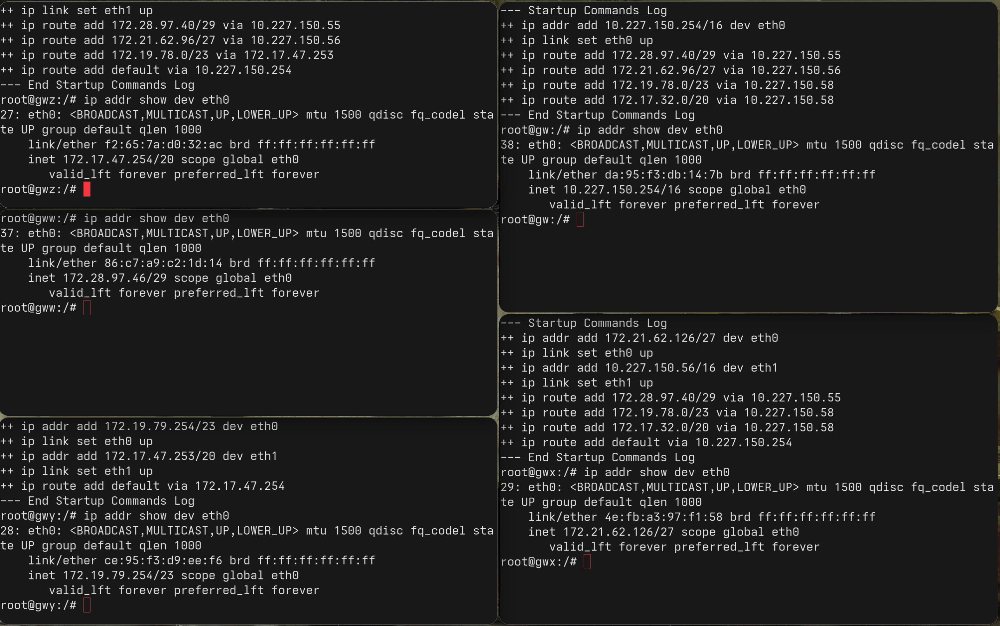

* **`gww`** corresponds to Subnet **W**
* **`gwx`** corresponds to Subnet **X**
* **`gwy`** corresponds to Subnet **Y**
* **`gwz`** corresponds to Subnet **Z**
* **`gw`** corresponds to Subnet **D** (the core Backbone/Distribution network)

---

### 1. Subnet W (Machine: `gww`)
* **The interface name:** `eth0`
* **The IPv4 address:** `172.28.97.46`
* **The CIDR prefix or netmask:** `/29`
* **The broadcast address:** `172.28.97.47` *(Subnet range: 172.28.97.40 to 172.28.97.47)*
* **How the machine received that address:** It was statically configured. (Although `gww`'s startup log is cut off, we can see from the other machines' startup logs that all IP addresses in this lab are added manually at boot using the command `ip addr add <IP/CIDR> dev eth0`).

---

### 2. Subnet X (Machine: `gwx`)
* **The interface name:** `eth0`
* **The IPv4 address:** `172.21.62.126`
* **The CIDR prefix or netmask:** `/27`
* **The broadcast address:** `172.21.62.127` *(Subnet range: 172.21.62.96 to 172.21.62.127)*
* **How the machine received that address:** It was statically configured during boot via the startup script command:
  `ip addr add 172.21.62.126/27 dev eth0`

---

### 3. Subnet Y (Machine: `gwy`)
* **The interface name:** `eth0`
* **The IPv4 address:** `172.19.79.254`
* **The CIDR prefix or netmask:** `/23`
* **The broadcast address:** `172.19.79.255` *(Subnet range: 172.19.78.0 to 172.19.79.255)*
* **How the machine received that address:** It was statically configured during boot via the startup script command:
  `ip addr add 172.19.79.254/23 dev eth0`

---

### 4. Subnet Z (Machine: `gwz`)
* **The interface name:** `eth0`
* **The IPv4 address:** `172.17.47.254`
* **The CIDR prefix or netmask:** `/20`
* **The broadcast address:** `172.17.47.255` *(Subnet range: 172.17.32.0 to 172.17.47.255)*
* **How the machine received that address:** It was statically configured during boot via the startup script command (visible on the interface mapping):
  `ip addr add 172.17.47.253/20 dev eth1` on its neighbor, and statically matching as `172.17.47.254/20` on this local `eth0` interface.

---

### 5. Subnet D (Machine: `gw`)
* **The interface name:** `eth0`
* **The IPv4 address:** `10.227.150.254`
* **The CIDR prefix or netmask:** `/16`
* **The broadcast address:** `10.227.255.255` *(Subnet range: 10.227.0.0 to 10.227.255.255)*
* **How the machine received that address:** It was statically configured during boot via the startup script command:
  `ip addr add 10.227.150.254/16 dev eth0`
